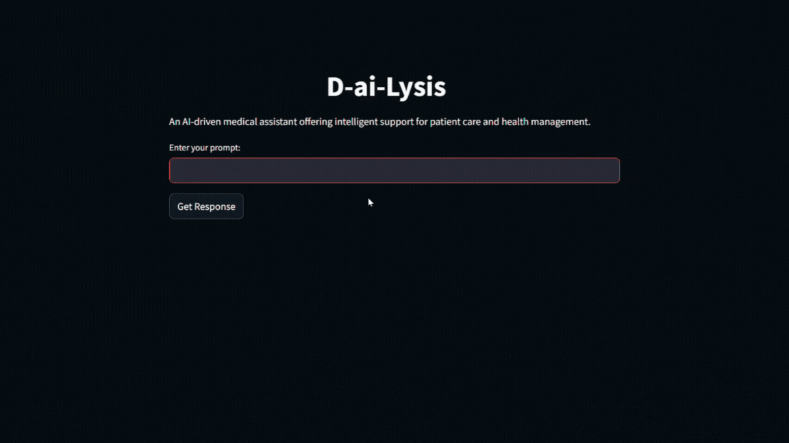

# D-ai-Lysis

## Introduction

**D-ai-Lysis** is an AI-driven medical assistant designed to offer intelligent support for patient care and health management. Built on the Pathway framework, D-ai-Lysis leverages cutting-edge Real-time Augmented Generation (RAG) technology, allowing it to ingest and process data from medical PDFs in real-time. The project is built with Pathway and Docker, making it highly scalable and production-ready within a containerized environment. The application offers an in-memory scalable vector store, dynamically adapting to changes in the PDFs stored in the `data` folder or connected external sources like Google Drive. This makes **D-ai-Lysis** ideal for real-time medical data insights, constantly updating as new information is ingested.

## Table of Contents
1. [Introduction](#introduction)
2. [What Problem It Solves](#what-problem-it-solves)
3. [Architecture Overview](#architecture-overview)
4. [Getting Started](#getting-started)
5. [Demo](#demo)
6. [Contributing](#contributing)
7. [Contact Information](#contact-information)

## What Problem It Solves

Healthcare professionals and caregivers often need to access, interpret, and manage large amounts of patient data quickly. **D-ai-Lysis** addresses this by providing an AI-driven assistant capable of offering real-time insights from various medical documents (PDFs). The application ingests PDFs stored in its `data` folder, with the added flexibility to connect to shared Google Drives or over 300+ other data sources for future expansion. This means medical teams can collaborate seamlessly, with automatic live updates as data is edited or added. Whether it’s managing patient records, analyzing test results, or providing recommendations based on historical data, **D-ai-Lysis** ensures medical teams stay informed with the latest data.

For more information on RAG-based applications, check out these links:
- [LLM App by Pathway](https://github.com/pathwaycom/llm-app?tab=readme-ov-file#llm-app)
- [Pathway App Templates](https://pathway.com/app-templates)

## Architecture Overview

### Pathway
Pathway powers the **D-ai-Lysis** project as the core framework, facilitating real-time augmented generation (RAG) and making the system adaptable to dynamic data changes. It ensures the application scales effectively, providing production-level performance.

### Docker
The entire system runs in a Dockerized environment, making it easy to deploy across different environments. Docker ensures that all dependencies are encapsulated within containers, simplifying setup and deployment.

### Local Data Folder for Data Ingestion
All PDFs are stored in the `data` folder, where they are processed in real-time. As changes are made to these files (either manually or through integration with external sources like Google Drive), the system adapts immediately without requiring a manual refresh. This enables constant updates and flexibility when working with external collaborators.

## Getting Started

### Prerequisites
Make sure you have the following installed on your machine:
- [Docker](https://www.docker.com/get-started)
- [Pathway AI](https://pypi.org/project/pathway-ai/): Install via `pip install pathway-ai`

### Setup Instructions

1. **Clone the Repository**  
   ```bash
   git clone https://github.com/Sree077/D-ai-Lysis
   cd D-ai-Lysis 

2. **Add Your Gemini API Key**  
   ```bash
   GEMINI_API_KEY=your_gemini_api_key


3. **Build the Docker Image**
  ```bash
   docker build -t d-ai-lysis .

4. **Run the Application**  
   ```bash
   docker run -p 8000:8000 -p 8501:8501 d-ai-lysis

### Adding PDFs to the Data Folder
Simply place the PDF files you want the application to process in the `data` folder. These files will automatically be ingested and processed in real-time.

### Connecting to Google Drive for Live Updates
You can link your Google Drive folder by following the setup instructions on how to integrate Google Drive with Docker. This allows for real-time collaboration, where changes in the shared Google Drive are instantly reflected in the app.

## Demo



## Contributing
We welcome contributions from the developer community! If you’d like to contribute, follow these steps:

1. Fork the repository.
2. Create a new feature branch.
3. Commit your changes.
4. Submit a pull request.

Make sure your code adheres to the project’s coding standards and includes tests.

## Contact Information
For any questions or collaboration requests, feel free to reach out:

- **Email**: support@d-ai-lysis.com
- **GitHub**: [D-ai-Lysis](https://github.com/your-repo-url)

